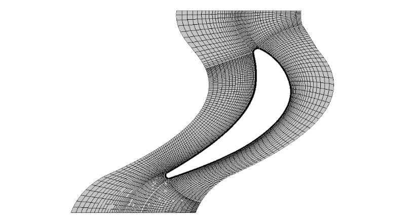
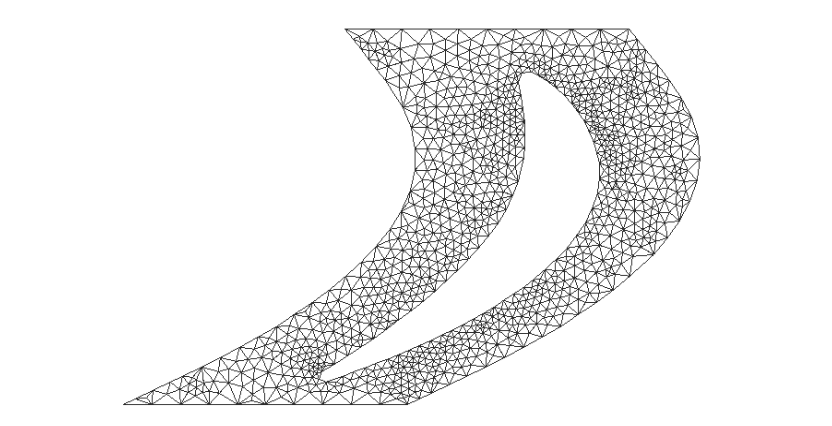
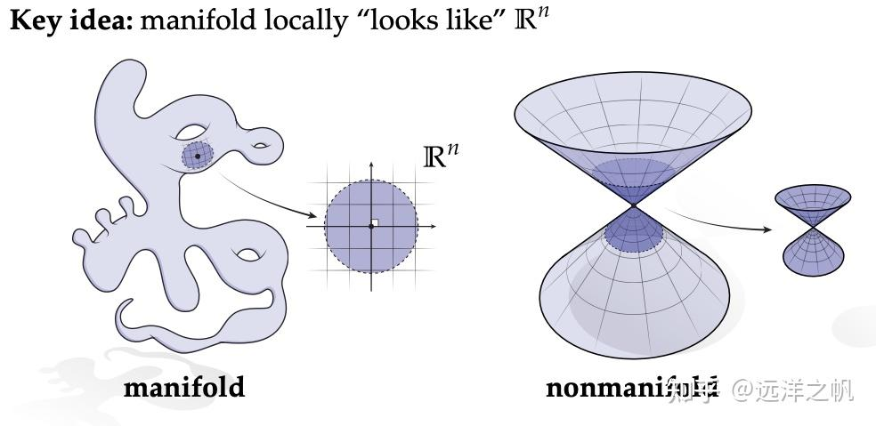
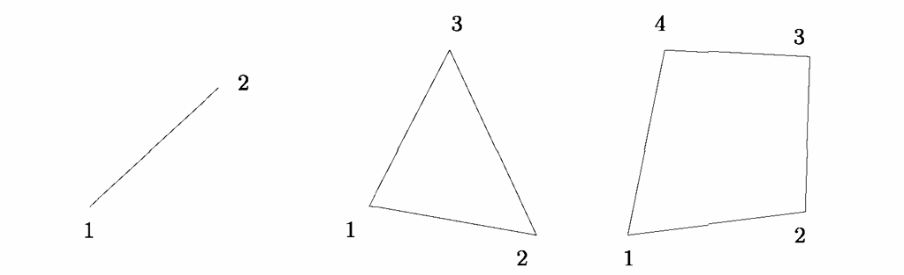
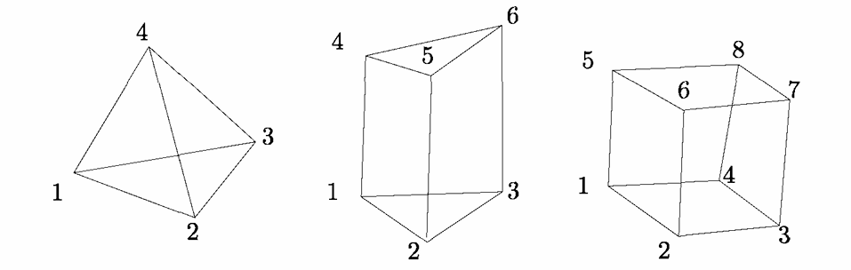

# 1.2 网格，网格单元，有限元网格

现在我们讨论另一个问题。设\( \Omega \)是 \( {\mathbb{R}}^{2} \)或\( {\mathbb{R}}^{3} \)的闭区域。问题是如何在该域内构造共形的三角剖分。这样的三角剖分将被称为\( \Omega \)的网格，记为\( {\mathcal{T}}_{r} \)或\( {\mathcal{T}}_{h} \) ，其命名原因后续会说明。因此：

**定义 1.6** 若满足以下条件，则\( {\mathcal{T}}_{h} \) 是\( \Omega \)的网格
- \( \left( {H1}\right) \; \)  \( \Omega  = \overline{\mathop{\bigcup }\limits_{{K \in  {\mathcal{T}}_{h}}}K} \)
- \( \left( {H2}\right) \; \)  \( {\mathcal{T}}_{h} \)中每个单元K的内部非空
- \( \left( {H3}\right) \; \) 两个单元内部的相交为空集

例如，对于梁单元，条件\((H2)\)显然不成立。条件\((H3)\)避免了单元重叠。与三角剖分的定义不同，这里不再假设条件\((H0)\)，这意味着顶点一般不是先验给定的（见后文），且在\((H1)\)中，K不一定是单纯形。

大多数以网格为空间支撑的计算格式都假设该网格是共形的（尽管对某些求解方法而言，这一性质并非严格必要）。

**定义 1.7** 若\( {\mathcal{T}}_{h} \) 满足定义1.6且满足以下条件，则\( {\mathcal{T}}_{h} \) 是\( \Omega \)的共形网格
- \( \left( {H3}\right) \; \) \( {\mathcal{T}}_{h} \) 中两个单元的交集要么是空集，要么是顶点、边(二维)或面(三维)。

三角剖分是对给定点集凸包的覆盖，通常由单纯形单元组成；而网格是对给定域的覆盖，在大多数应用中通过域边界的离散化定义，且单元可能是非单纯形的。

由此引出两个新问题：
- 强制域的边界，使剖分成为约束剖分
- 必须构造定义网格顶点的点集。通常，给定边界离散化的边界点是唯一的输入，内部点必须显式创建。

**注解 1.4** 对于定义域的边界离散化，二维空间中存在符合该离散化的网格，但从计算机实现角度看，三位空间中仍是一个棘手的问题。

**注解 1.5** 在有限元法中，网格⁷通常记为\( {\mathcal{T}}_{h} \) ，其中下标\(h\)表示网格中单元尺寸，这些量用于误差约束定理。

如前所述，网格可由不同几何类型的单元组成。一维网格由有限数量的线段组成；二维网格由线段、三角形和四边形（简称 “quad”）组成；三维网格则由上述单元，以及四面体（简称 “tet”）、五面体和六面体（简称 “hex”）组成。网格单元通常需根据具体应用满足一些特定性质。

根据连接性，网格可主要分为三类。

⁷需要注意的是，具有有限元背景的人会使用 “三角剖分” 一词，且将 “网格” 与之视为同义词。

**定义 1.8** 网格的连接性是指网格顶点之间连接关系的定义。

**定义 1.9** 若网格的连接性属于有限差分类型，则该网格称为结构化网格；若连接性是其他类型，则成为非结构化网格。

结构化网格也可称为网格（grid）⁸。二维情况下，网格单元是四边形；三维情况下，网格由六面体组成。节点间的连接性为\((i,j,k)\)型，即给定一个节点的索引\((i,j,k)\)，其 “左” 邻居节点索引为\((i-1,j,k)\)，“右” 邻居为\((i+1,j,k)\)。这种网格适用于几何形状与该性质匹配的场景，即广义的四边形或六面体结构。

**脚注 8 说明** 需注意，有些作者使用 “grid” 一词指代任何类型的网格，无论其连接性如何。

**注解 1.6** 除四边形或六面体网格外，特殊网格也可具有结构化连接性。例如，可考虑经典的四边形网格，其中每个四边形都用相同的细分模式分成两个三角形。
这类网格通常由三角形（四面体）组成，也可由四边形（六面体）或更一般地由不同几何类型的单元组合而成。注意，非结构化的四边形或六面体网格中，内部顶点可能被超过 4（8）个单元共享（这与结构化网格不同）。

为完整起见，我们再引入两个定义。

**定义 1.10** 若网格包含不同几何类型的单元，则称其为混合网格。

**定义 1.11** 若网格包含不同空间维度的单元，则称其为杂交网格。

二维混合网格由三角形和四边形组成；二维杂交网格显然也是混合网格，例如包含三角形和线段。

为完善分类，网格可分为流形网格或非流形网格，这一点仅针对曲面网格。

**定义 1.12** 对于（共形的）曲面网格，若其内部边恰好被两个单元共享，或对于开曲面的边界边仅被一个单元共享，则称该曲面网格为流形网格。

否则，该曲面网格称为非流形网格，例如包含加强筋或具有两个及以上连通分量的曲面网格。

([参考网页](https://zhuanlan.zhihu.com/p/937412220))

## 网格单元
单元是网格的基本组成部分。单元由几何类型（三角形、四边形等）和顶点列表定义。该列表遵循一定的规则（见后文），可完整定义单元，包括其边和面（三维情况下）的定义。

**定义 1.13** 网格单元的连接性是指在单元层面上顶点之间连接关系的定义。

这种连接性是网格连接性的局部等价形式，使得描述单元的拓扑成为可能。

**定义 1.14** 网格单元的拓扑是指其面、边和顶点之间关系的定义。

为方便起见，顶点和边的（局部）编号预先定义，从而隐式地引入一些性质⁹。这一定义只是一种约定，用于导出隐式性质。特别地，顶点的有序编号使我们能够以正的或有向的意义计算三角形的表面积，也允许我们评估每条边的有向法向量。

**脚注 9** 基于隐含定义的顶点编号，可对边和面进行隐式定义，从而避免在单元层面显式定义这些实体（显式定义不唯一且耗内存）。

对于连接性为\([1,2,3]\)的三角形，选定第一个顶点 (1) 后，其余顶点按逆时针顺序编号。此时，拓扑可通过边的定义明确：
- 边 [1] 从顶点 (1) 到顶点 (2)，
- 边 [2]：(2)→(3)，
- 边 [3]：(3)→(1)；

或者，另一种定义方式：
- 边 [1] 与顶点 (1) 相对，表示从顶点 (2) 到顶点 (3)的边，
- 边 [2]：(3)→(1)，
- 边 [3]：(1)→(2)。

一旦选定一种拓扑，所有网格单元必须遵循该规则。这种隐含定义此后会简化流程，避免在计算步骤中对单元层面进行显式定义。

### 常见单元的连接与拓扑
除三角形外，其他单元可基于上述两个定义来描述。

- 线段：\([1,2]\)，边为\((1) \to (2)\)。
- 四边形：\([1,2,3,4]\)，编号方式与三角形类似，边的定义为：
边 [1]：\((1) \to (2)\)；边 [2]：\((2) \to (3)\)；
边 [3]：\((3) \to (4)\)；边 [4]：\((4) \to (1)\)。

|    |
| :--------: |
|  图 1.4 给定第一个顶点编号时，线段、三角形和四边形的局部顶点编号 |

|    |
| :--------: |
|  图 1.5 四面体、五面体和六面体的顶点编号示例 |

四面体¹⁰ ：\([1,2,3,4]\)，假设\((\vec{12},\vec{13},\vec{14})\)为正方向，边的定义为：
边 [1]：\((1) \to (2)\)；边 [2]：\((2) \to (3)\)；边 [3]：\((3) \to (1)\)；
边 [4]：\((1) \to (4)\)；边 [5]：\((2) \to (4)\)；边 [6]：\((3) \to (4)\)；
面的定义为：
面 [1]：\((1)(3)(2)\)；面 [2]：\((1)(4)(3)\)；
面 [3]：\((1)(2)(4)\)；面 [4]：\((2)(3)(4)\)。

**脚注 10** 与三角形类似，四面体的面也可采用 “面 [i] 与顶点 (i) 相对” 的替代定义，这种约定能简化拓扑描述。

五面体：顶点编号为\([1,2,3,4,5,6]\)，且向量组\((\vec{12},\vec{13},\vec{14})\)为正方向（用于定义拓扑的定向规则）。
边的定义：共 9 条边，每条边明确了顶点间的连接方向（如边 [1] 为\((1) \to (2)\)，边 [4] 为\((1) \to (4)\)等）。
面的定义：共 5 个面，每个面由顶点的有序组合定义（如面 [1] 为\((1)(3)(2)\)，面 [3] 为\((1)(2)(5)(4)\)等）。

六面体：顶点编号为\([1,2,3,4,5,6,7,8]\)，且向量组\((\vec{12},\vec{14},\vec{15})\)为正方向（用于定义拓扑的定向规则）。
边的定义：共 12 条边，每条边明确了顶点间的连接方向（如边 [1] 为\((1) \to (2)\)，边 [5] 为\((1) \to (5)\)等）。
面的定义：共 6 个面，每个面由顶点的有序组合定义（如面 [1] 为\((1)(4)(3)(2)\)，面 [3] 为\((1)(2)(6)(5)\)等）。

除六面体外，还可定义棱锥等其他单元类型。这类单元在混合网格中具有灵活性，例如当结构化六面体网格必须与非结构化四面体网格组合时，可通过这类单元实现过渡。

## 有限元网格
此前我们将网格视为几何实体，现在聚焦有限元网格，因为它在有限元计算中至关重要。如第 20 章所述，有限元将基于网格单元构建，为此需定义节点、自由度、插值方案等，以构造刚度矩阵、右端项等结构，从而求解问题。

有限元计算的经典步骤（以线性系统求解为例）
- 定义计算域；
- 网格构建：完成网格（几何）单元的列表；
- 插值步骤：从网格单元构造有限元；
- 矩阵与右端项构造：基于单元连接性，完成初始方程离散后的系统；
- 求解步骤：计算上述系统的解

后续将基于此给出有限元网格的相关定义，为深入讲解有限元方法的实现奠定基础。

### 节点（Node） 的定义
有限元在计算阶段与网格单元关联，此时有限元可视为附带节点列表的几何单元。

**定义 1.15** 节点是支撑一个或多个未知量（或自由度，dof）的点。

节点的定义由计算中使用的插值方法决定。对于给定几何单元，插值方式不同会对应不同的有限元：
- 最简单的是拉格朗日\(P^1\)有限元，节点为单元顶点；
- 拉格朗日\(P^2\)有限元，节点包括单元顶点和每条边的一个点（通常是边中点）；
- 其他有限元可能在边、面或单元内部设置多个节点，单元顶点也可能不是节点（详见第 20 章）。

节点位置确定后，需定义有限元节点的局部编号：若节点仅为单元顶点，编号可直接沿用顶点编号；若节点位于其他位置（如边中点、面内点），需明确局部编号规则。例如拉格朗日\(P^2\)三角形，通常前三个节点为顶点，第四个节点为第一条边的中点，依此类推（详见第 20 章、第 17 章的节点编号问题）。

### 物理属性
在求解阶段，有限元是各类计算或特殊处理的支撑。网格需通过其单元包含信息，以实现单元、面、边、节点的选取，进而处理与问题相关的载荷、流动、压力、边界条件、图形显示等需求，完成相关赋值或积分计算。需将物理属性与所有网格实体（单元、面、边、节点）关联，实现方式多样。

### 几何属性
对一些操作（如非\(P^1\)有限元的节点定义、子域定义）很有用。需将几何属性与所有单元实体（面、边、节点）关联。