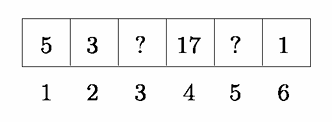
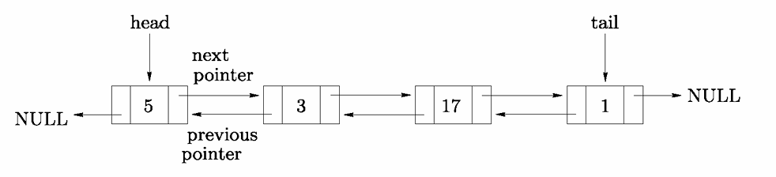
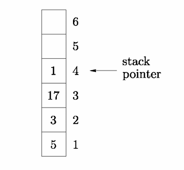
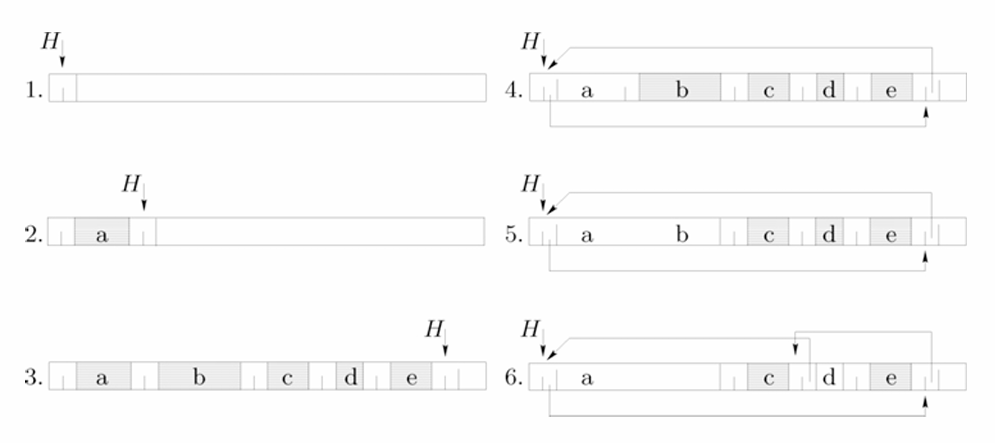
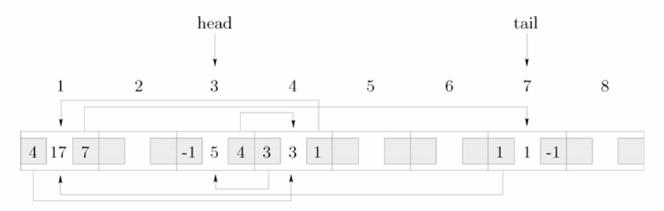

# 2.2 基本结构
在本节中，我们将介绍数组、指针、链表、栈和队列。以下将通过刻意简化的示例对这些结构进行简要介绍。

## 数组
数组无疑是众多应用场景中最简单且最高效的数据结构。数组可简单定义为一组固定的（连续的）内存空间，其中性质相同（更准确地说，存储需求相同）的项目按顺序存储，且可通过一个或多个索引进行访问。重要的一点是，数组允许**直接访问**其任意元素。实际上，若数组起始地址为\( a \)，且每个项目需要\( b \)个内存字来存储，那么索引为\( i \)的项目起始地址为\( a + (i-1)b \)。这一简单特性意味着数组是一种便捷的数据结构，易于使用，因此被用作更复杂结构（树、哈希表、网格等）的基础组件。
||图2.1 一个长度为6的数组|
|:---:|:---:|

图2.1展示了一个长度为6的数组示例，其中包含整数值。项目3和5尚未赋值，因此对应的值未定义（用“？”符号表示）。

数组结构的固有缺陷（除了需要检测可能的溢出外）与其使用前所需的静态内存分配有关。换句话说，若在某一时刻需要更多空间，必须分配一个新数组，并将旧数组复制到这个新数组中。

数组可用于存储向量（单索引数组）、矩阵（双索引数组）等，且如前所述，数组被用作更复杂数据结构的基础组件。

## 链表
链表是另一种数据结构,与数组中项目在内存的某一部分连续排列不同，链表的节点可通过内存中的地址（或更准确地说，通过指针）进行访问。指针的概念在大多数编程语言中天然存在，若不存在，也可如2.5节所示进行模拟。

||
|:---:|
|图2.2 双向链表存储与图2.1相同的数据|

为了说明，我们现在描述双向链表的情况。在这种情况下，每个节点包含三个字段：代表预期信息的**数据值**，以及两个用于访问相邻节点的**指针**。为了正确处理链表，我们还需要另外两条信息：链表的**头**和**尾**（如图2.2所示）。头和尾分别用于访问链表的第一个和最后一个节点。要检查某个数据值是否包含在链表中，只需从表头开始遍历链表表，沿着指针查找，直到找到该数据值或到达链尾（此时，若该数据值不在最后一个节点中，则说明它不在链表中）。

在列表中添加或删除一个项目，相当于添加一个节点并更新相关指针，或断开现有指针，同时在必要时管理头指针和尾指针。

存在多种类型的列表（除了双向链表之外）。实际上，还能找到简单链表（省略两个指针中的一个）、循环链表（项目可通过循环顺序访问）、排序链表等。无论哪种情况，链表都是管理动态实体集合（实体数量在过程中会变化）的一种简单且灵活的方式，尽管在某些情况下（2.3节），搜索操作的成本可能很高。因此，需要注意的是，链表非常适合用于所考虑的值不遵循任何特定顺序的情况。还要注意，有时必须提前知道链表的大小（如果它是作为数组实现的），否则在其演化过程中会进行动态分配。

**注解 2.1** 链表可以包含非单一值的数据（某些语言允许这样做）。

**练习 2.1** 说明如何实现循环列表。需要多少个指针？

**练习 2.2** 分析一种基于链表但实体指向数组的数据结构。这种组织方式有望带来哪些优势？

## 栈
就像一摞盘子，只有栈顶的盘子能被取到一样，栈是一种仅允许访问最后插入项的数据结构。因此，它被称为后进先出（LIFO）列表。与栈相关的常规操作有两种：`Push`（将一个项添加到栈顶）和`Pop`（移除栈顶的项，前提是栈不为空）。

栈非常容易实现，只需同时使用一个数组（栈本身）和一个整数（栈指针）即可，栈指针用于指示栈中最后存储项的索引，如图2.3所示。
||图2.3 栈存储与图2.1或2.2相同的数据|
|:---:|:---:|

若栈指针为空（无效），则栈为空。若该指针超过栈的大小，栈就会溢出。在这种情况下，一种解决方案是分配一个更大的数组，并将旧栈复制到这个新结构中。另一种解决方案是使用链表（参见下一个练习）。

**练习 2.3** 我们可以使用简单链表还是应该使用双向链表来实现栈？

### 队列
队列是一种行为与人群队列（如在邮局中看到的那种）非常接近的数据结构。队列的主要操作是访问下一个实体，这相当于将该项从队列中移除。此外，每个新项都被添加到队列的末尾。按照这种逻辑，我们得到的是先进先出（FIFO）结构。如果用于实现队列的数据结构（例如数组）是有界大小的，那么当向已满的队列中添加项时，就会出现溢出。另一方面，尝试从空队列中移除项会导致下溢。

简单链表提供了实现队列所需的所有功能。然而，如果要存储的项的最大数量是提前已知的，那么数组更可取，因为它避免了内存分配或释放的问题以及可能的溢出。有关更多细节，请读者参考[Cormen等人1990]和下面的练习。

**练习 2.4** 找到一种使用固定大小数组实现队列的数据结构，并解决溢出和下溢问题（提示：如果到达队列的头（尾）且数组中存在可用空间，“移动”（压缩）队列中的项）。

## 对象与指针
在2.2节中，我们假设可以为每个实体关联一个或两个额外的字段（指针），用于索引相同类型的节点。一方面，某些语言中可能不存在指针的概念；另一方面，如果项目的数量是提前已知的，那么使用指针就没有意义了。为了说明这一点，我们来看看这种情况下的内存分配/释放问题。处理这种情况的一种简单方法是管理一个空闲内存条目列表，即**空闲列表**。当需要更多空间时，我们采用**首次适应法**：遍历该列表，使用第一个可用的、大小合适的空闲内存块。如果该区域大于所需，就将其拆分，剩余的块添加到空闲列表中。类似地，添加空闲块时，将其引用到空闲列表中（如果相邻的内存块也是空闲的，可能会将其与这些相邻块合并）。

这一点在图2.4中得到了强调，其中\( H \)表示空闲列表头部的指针。注意，每个信息单元都关联了两个整数，一个是指向空闲列表中另一块的指针，另一个是给出实际块大小的整数（用于首次适应操作）。在示例中，我们按顺序分配了\( a \)、\( b \)、\( c \)、\( d \)和\( e \)。如果\( a \)变为可用，且\( b \)也变为可用，那么区域\( a \cup b \)就被定义为空闲（可用）。接着，\( d \)变为可用，空闲列表由此得到维护。

||
|:---:|
|图2.4 首次适应法的内存管理|

幸运的是，存在更复杂但耗时更少的内存管理机制。不过，如果所需内存的大小无法提前知晓，或者不存在指针的概念，就必须关注内存管理过程。我们在使用存储在数组中的双向链表的情况下强调这一点。每个记录包含给定的信息以及两个整数，这两个整数定义了列表中下一个和上一个记录。图2.5的示例说明了针对图2.2中列表的这种实现方式。同样的表示也可以通过三个数组（一个用于存储值，一个用于指向下一个项目的指针，一个用于指向上一个项目的指针）来实现，而非仅用一个数组。

||
|:---:|
|图2.5 用数组实现图2.2的链表|