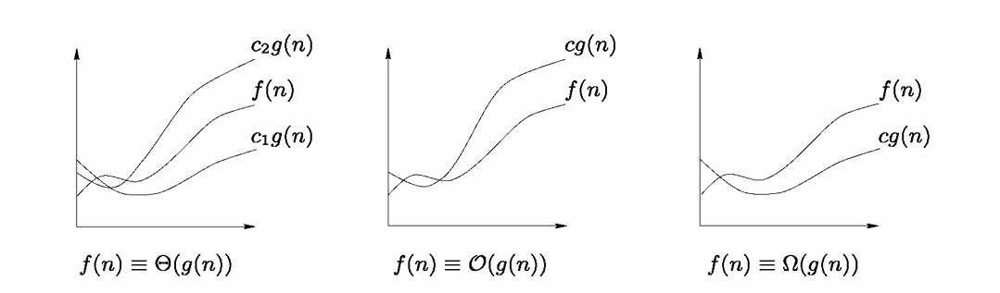

# 2.3 关于复杂度的基本概念
我们在此讨论与算法复杂度相关的问题。正如将要看到的，这一概念涉及多个方面，并会影响对算法“质量”的认知。

## 函数的行为
如2.1节所述，构建算法和数据结构需要评估涉及的操作次数，此外还要仔细研究内存问题。

解决这些问题需要分析算法和数据结构的**时间复杂度**以及**空间复杂度**。分析这些概念的一种简单且通用的方法是引入一个与问题输入规模\( n \)相关的数学函数\( f \)，例如，\( n \)可以是三角剖分中要插入的点数。找到\( f(n) \)的精确值可能很困难，甚至不可能。然而，我们通常并不关注这个精确值，而是关注其大致的估计。存在几种量化这一点的方式，常用的记号有\( f(n) \equiv \Theta(g(n)) \)、\( \Omega(g(n)) \)、\( O(g(n)) \)或\( o(g(n)) \)，它们分别表示：对于足够大的\( n \)和“已知的”\( g(n) \)，有：
- \( \Theta \)：\( c_1 g(n) < f(n) < c_2 g(n) \)，其中\( c_1 \)和\( c_2 \)是两个常数。因此，当\( n \)增长时，\( f \)和\( g \)具有相同的行为。
- \( O \)：\( f(n) < c g(n) \)，\( c \)为常数，即我们得到一个上界。
- \( \Omega \)：\( f(n) > c g(n) \)，\( c \)为常数，即我们得到一个下界。
- \( o \)：对任意正常数\( c \)，有\( f(n) < c g(n) \)。

\( O \)和\( o \)的量化可以看作是从略微不同的角度比较两个函数边界的两种方式。实际上，对这两种度量的一种描述方式是，对于\( O \)：
\[ \lim_{n \to \infty} \frac{f(n)}{g(n)} < c, \]
而对于\( o \)，我们有：
\[ \lim_{n \to \infty} \frac{f(n)}{g(n)} = 0. \]

例如，注意\( 2n^2 = O(n^2) \)但\( 2n^2 \neq o(n^2) \)，而\( n\log n = O(n^2) \)且\( n\log n = o(n^2) \)同时成立。这些关系表明了函数的渐近行为，参见图2.6。

||
|:---:|
|图2.6 |

不过需要注意，前面的表达式中涉及的常数可能非常大。例如，一个复杂度为\( n^2 \)的算法，若\( n \)小于100，理论上比复杂度为\( 100n \)的算法更快；若\( n \)大于100，则更慢。另一点需要说明的是，复杂度衡量的是输入规模较大时的行为，而非小规模问题的行为。这一点将在2.4节讨论排序算法时进行探讨。

**练习 2.5** 对于哪些值，复杂度为\( n^3 \)的算法比复杂度为\( 1000n^2\log n \)的算法更高效？

**练习 2.6** 设\( f \)和\( g \)是两个渐近为正的函数。在以下断言中，指出哪些为真，哪些为假：
- \( i) \) 若\( f(n) = \sqrt{n} \)，\( g(n) = n^{\sin n} \)，则\( f(n) = O(g(n)) \)
- \( ii) \) \( f(n) + g(n) = \Theta(\min(f(n), g(n))) \)
- \( iii) \) \( f(n) = O(g(n)) \)意味着\( 2^{f(n)} = O(2^{g(n)}) \)
- \( iv) \) \( f(n) = O(g(n)) \)意味着\( \left(1 + \frac{1}{\log n}\right)f(n) = O(g(n)) \)

## 复杂度：最坏情况、平均情况、最优情况
回顾对算法复杂度的研究，需要注意可以定义多种复杂度。具体来说，涉及：
- 最有利情况和最坏情况下的复杂度，即严格所需的操作次数的最小值和最大值；
- 平均复杂度，即对一系列情况的复杂度取平均后得到的复杂度。

最坏和最优复杂度通常很容易确定，因为只需考察极端配置即可。然而，平均复杂度需要引入概率。现在通过示例说明这些概念：

#### 算法2.4 在数组\( \text{Tab} \)中搜索值\( x \)
- **过程 IsContainedInArray(\( \text{Tab}, x, \text{found} \))**
\( i \leftarrow 1 \)
\( \text{found} \leftarrow \text{.FALSE.} \)
**WHILE** \( (\text{found} = \text{.FALSE.}) \) 且 \( (i \leq n) \)
    **IF** \( \text{Tab}(i) = x \) **THEN** \( \text{found} \leftarrow \text{.TRUE.} \)
    **ELSE** \( i \leftarrow i + 1 \)
**END WHILE**
**IF** \( i = n + 1 \) **THEN** \( \text{found} = \text{.FALSE.} \)（未找到，\( x \)不存在）
**ELSE** \( \text{found} = \text{.TRUE.} \)（找到）
**END IF**

其目的是判断给定值\( x \)是否在数组\( \text{Tab} \)的索引\( i \)处，数组\( \text{Tab} \)的长度为\( n \)。问题是要确定该算法在最优情况、最坏情况和平均情况下执行的比较次数。

如果数组的第一个元素就是\( x \)，算法只需一次测试就会停止，其最优复杂度为1。如果数组中不包含\( x \)，则需要进行\( n \)次比较才能得出结论。在\( x \)存在于数组中的情况下，求平均值时，比较次数为：
\[ E(x \in \text{Tab}) = \sum_{i=1}^{n} i \Pr(x, i) \]
其中\( \Pr(x, i) \)表示在数组索引\( i \)处找到\( x \)的概率。由于\( \Pr(x, i) = \frac{1}{n} \)，我们得到\( E(.) = \frac{n+1}{2} \)，可写成\( E(.) = \Theta(n) \)。换句话说，如果数组未排序，平均预期的测试次数数量级为\( n \)。

这三种复杂度度量显示了不同的信息。更准确地说，每当算法的运行时间是固定的，最坏复杂度就是一个很好的度量。我们在这里可以看到具体的场景，例如，根据问题输入的大小，我们预期会有线性等给定的复杂度。实际上，在这种情况下，最坏情况给出了所需的信息。

**练习 2.7** 前面的示例中，在WHILE行需要进行两次相等性测试和一次比较，因此共三次测试。请说明，如果将待查找的值\( x \)插入到数组的索引\( n+1 \)处（将数组大小增加1，这个新节点称为“哨兵”），测试次数可以减少到仅一次。

## 均摊复杂度
另一种复杂度概念称为**均摊复杂度**，用于度量最坏情况下每个操作的平均性能。更具体地说，有些算法或结构的特点是，成本较高的操作执行得非常少。在其他一些情况下，一次成本较高的操作意味着后续所需的操作会比较便宜。栈的情况就是这种行为的一个示例。

考虑一个栈，假设存在操作`Multi-Pop(Pile, k)`，它由对`k`个项执行`Pop`操作组成（`k`小于或等于栈的大小）。现在来看由`n`次`Push`、`Pop`和`Multi-Pop`组成的操作序列。`Push`和`Pop`的复杂度为\( O(1) \)，而`Multi-Pop`在最坏情况下的复杂度为\( O(n) \)，因此，`n`次操作序列的最坏情况复杂度为\( O(n^2) \)。但这是该算法的真实复杂度吗？

由于每个项最多被弹出一次，`Pop`（包括`Pop`和`Multi-Pop`）的次数最多等于`Push`的次数，即大约\( O(n) \)。因此，无论`n`的值是多少，由`Push`、`Pop`和`Multi-Pop`组成的操作序列的时间复杂度为\( O(n) \)。实际上，该操作的均摊复杂度为\( \frac{O(n)}{n} = O(1) \)。总而言之，这个量度用于衡量在执行一组操作的过程中，最坏情况下每个操作的平均效率。